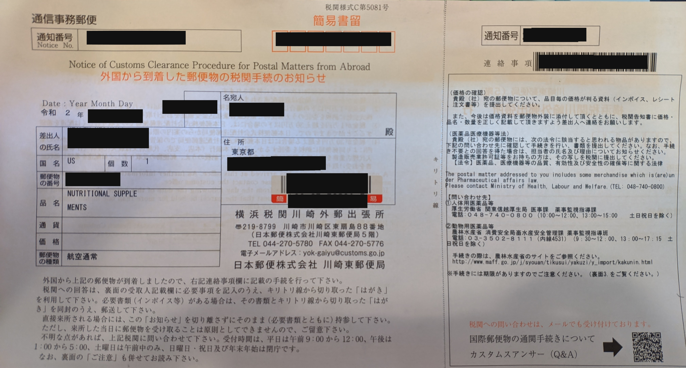
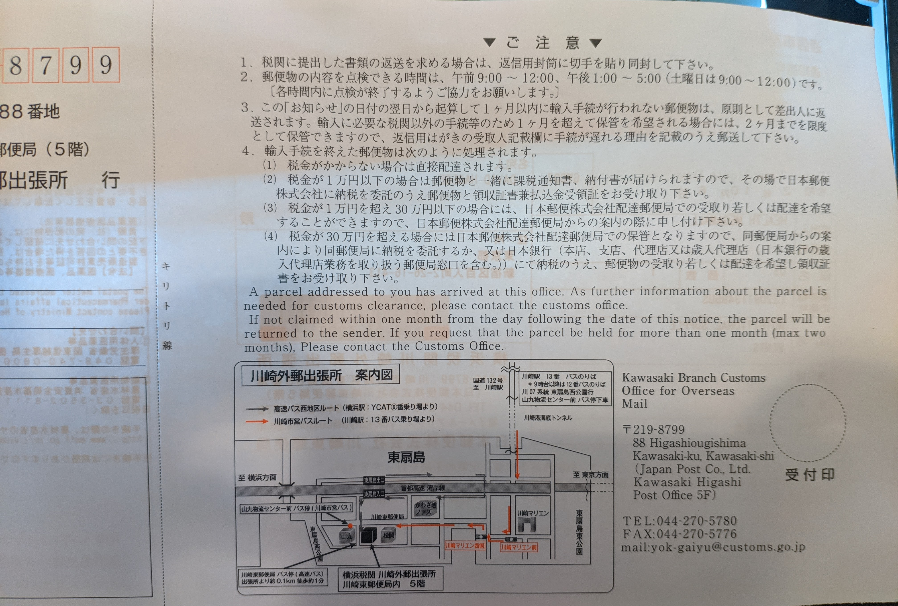

# Drug laws

## Speaking positively about marijuana online leads to arrest of Japanese man and woman

https://japantoday.com/category/crime/speaking-positively-about-marijuana-online-leads-to-arrest-of-japanese-man-and-woman

Actual source of the law:  
[Japan_Anti_Drug_Special_Provisions_Law_1991 [PDF]](./assets/Japan_Anti_Drug_Special_Provisions_Law_1991.pdf)

<blockquote>
(Incitement or Solicitation) Article 9. Any person who publicly incites or solicits others to commit any drug offense (except for offenses specified in the preceding article and this article) or any offense specified in Article 6 or Article 7 or to abuse any controlled substance shall be imprisoned with hard labor not exceeding three years or fined not more than five hundred thousand yen. 
</blockquote>

Interestingly:  

<blockquote>
2. Any person who with intent to commit any drug offense (limited to those involving transfer, receipt or possession of any controlled substance) transfers to or receives from another person any drug or other article as a controlled substance or possesses any drug or other article that the said person has received or acquired as a controlled substance, shall be imprisoned with hard labor not exceeding two years or fined not more than three hundred thousand yen.
</blockquote>

So it's actually worse to talk about drugs online and inciting others to use drugs than to actually possessing/exchanging some, 3 years jail time max for the former, 2 years for the latter.  
Free speech has its limits as you can see, so be careful of what you say online..

## Legal drugs importation

The Phamaceutical Affairs Law says you can import a two months supply for personal use of medical supplies which are not illegal drugs.  
Two months supply meaning absolutely nothing as it depends on how much you take a day, basically import the strict minimum.  
For medicine requiring prescription you can only import one month use.  

Source: https://www.customs.go.jp/tokyo/english/yubin/yakuji.htm

### Melatonin

<blockquote>
In Japan, the Pharmaceutical Affairs Law has banned the sale of melatonin itself, including supplement forms.  
Oct 26, 2016
</blockquote>

I have no idea why such a basic and extremely safe supplement was banned in Japan.  
The Pharmaceutical Affairs Law says you can import one-month supply for personal use. One month supply meaning absolutely nothing as it depends how much you take a day, basically never import more than one bottle.  
If you import 2 bottles you will get a love letter like this one:  

Yes, Insanity.  

The funniest thing is that L-Tryptophane is perfectly legal to sell in Japan, and it's a precursor of Melatonin.  
Interestingly, Japan was producing pretty terrible L-Tryptophan in the past which caused 37 deaths.  

https://en.wikipedia.org/wiki/Tryptophan#Side_effects  

> There was a large outbreak of eosinophilia-myalgia syndrome (EMS) in the U.S. in 1989, with more than 1,500 cases reported to the CDC and at least 37 deaths.[36] After preliminary investigation revealed that the outbreak was linked to intake of tryptophan, the U.S. Food and Drug Administration (FDA) recalled tryptophan supplements in 1989 and banned most public sales in 1990,[37][38][39] with other countries following suit.[40][41]

> Subsequent studies suggested that EMS was linked to specific batches of L-tryptophan supplied by a single large Japanese manufacturer, Showa Denko.[37][42][43][44] It eventually became clear that recent batches of Showa Denko's L-tryptophan were contaminated by trace impurities, which were subsequently thought to be responsible for the 1989 EMS outbreak.[37][45][46] However, other evidence suggests that tryptophan itself may be a potentially major contributory factor in EMS.[47] 