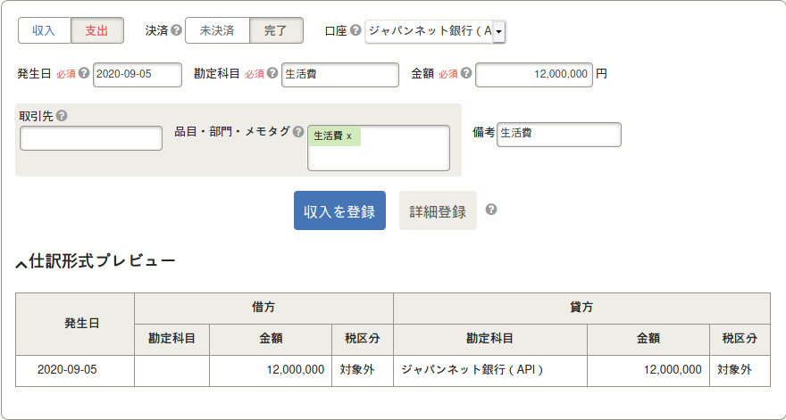

# Japan's Taxes

>“Give a poor man a fish and you feed him for a day. Teach him to fish and you give him an occupation that will feed him for a lifetime.”  
>-- A very smart Chinese person.

Disclaimer:  
I'm not a tax accountant, I'm a software engineer. You don't have to trust me on anything though.  
I'll source everything I say as much as possible. Don't trust anything anyone is saying without a credible source.  
My goal is to reference what I know about taxes as a freelancer in Japan (個人事業).  
If you don't care about knowing how things work and just want to be done with it, ask a tax accountant to do the job for you instead. If you agree with the quote above instead, and want to learn so that you don't have to trust anyone and be dependent on a tax accountant continue to read.


# How to start doing business as a freelancer

First you need to send the notice of opening of your business (個人事業の開廃業等届出書).  
It's a simple form you simply have to send and you are done. You also need to send another form telling the tax office that you'll fill the Blue form tax declaration this year.  
There are 2 types of final tax return declaration, the white form and the blue form. The white form is super easy and anyone can do that one without sending any document prior to the tax office.  
But as a freelancer you should file the blue one, because it has better tax reducing schemes.  

I'm not going to explain how to the 個人事業の開廃業等届出書 form, and you don't even have to understand fully how to either.  
Just use [freee.co.jp](free.co.jp). It's a tax accounting SAAS. They have a step-by-step process to fill that form and it's super easy. And at the end you just have to print it and send it. They also prepare for you the form telling the tax office that you'll fill the blue form this year.  

Then create your kojin jigyo account on freee.  

I highly recommend you to open a business bank account too. You'll synchronize that bank account on free. It's much easier than using your personal bank account trust me. You don't want to mix expenses with personal stuff.  
For the business bank accounts, I highly recommend you to use [Japan Net Bank](https://login.japannetbank.co.jp/wctx/AF.do?SikibetuId=2014000090). Opening a business account with them takes a few minutes, you can even send the required IDs with your mobile phone.  
I also highly recommend you to get the [Freee visa card](https://www.freee.co.jp/finance/card/smcc/). You'll be able to sync that card to your freee account so that everything you buy with it magically appears in your books.  

This will take a week or so to get both the credit card and the bank account opened.  
As soon as your get these, add them to freee, so they stay in sync from the beginning.

# Bookkeeping

## How do I charge for my labor with freee?  
  Freee has an invoicing system, use it, everything is automatically handled by freee afterwards. Simply create a new invoice. Don't forget to add the VAT to your invoices. The VAT should be paid by the customer, don't trust anyone telling you the opposite, they are trying to pay you less than they should.  
And you have to be careful not to use that VAT money as you have to give it back to the government later.

## What are accounts? (勘定科目)  
  This is used to determine what is the type of the income/expense you are putting in the book (e.g, travel expense? Meeting Fee?). All entries in your book need to refer to a specific "account" . freee already helps you by having a long list of different accounts you can use. This is a whole new can of worms though, check [Accounts](#accounts--勘定科目) section to learn more.

## 事業主貸 vs 事業主借  
  This one is super important. These are 2 types of "accounts" (勘定科目) you can use in your books.  
  - 事業主貸 is used when you want to TAKE money from the company business account.  
    For instance when you pay yourself at the end of the month, this is what you should use.
  - 事業主借 is used when you GIVE money from your personal money (can even be cash, source doesn't matter) to your business.

## How can I pay myself every month?  
  Every month you'll receive your money on your business account. But as a sole proprietorship you don't really have a "salary" per se. But you still want to get that money back on your personal bank account right?  
  Here is how it works.  
  Do NOT sync your personal bank account on freee. That will make everything more complicated.  
  First do the bank transfer from your business account to your personal one.  
  Then, let freee sync your business bank account so the new transaction appears.   
  All you have to do is now to register this as an expense with 事業主貸 as account type, 対象外 (out of scope) as tax rate (because there is no tax involved), you can put living expenses (生活費) as item name to help find these "salary" transactions easily. It should basically look like that:  

  

  That's all you need to do. By doing that, now your balance on freee and in real life should be exactly the same. Nothing has been lost because you mentioned you moved money out of the business for your living expenses.

## My synced credit card balance on freee is negative  
  That happens to me too. Free has some [documentation](https://support.freee.co.jp/hc/ja/articles/202847670) on it. In my case that happens because my freee business card takes money every month from my personal bank account instead of my business one (I wanted to open everything at once and not wait for the business bank account to be open to get the freee credit card, so I had to set it up to my personal account).  
  So every month when I pay my credit card balance that amount of money is not registered automatically and the balance will then be shown as negative.  
  This is easy to fix by using the 事業主借 account type. Remember, 事業主借 is used when you GIVE money to the company.  
  So you simply have to create a new entry in the book, this time set it up as income (収入) instead of expenditure (支出), select your synced credit card as account (口座), the date when the credit card balance was paid, and put 事業主借 as account type.


## What if I buy something online in any other currency than JPY?  
  This one is super complex, because the change rate matters, and the VAT too.  
  You can in theory register earnings / loss with change rate etc. But that's extremely complicated and I doubt you'll gain anything.  
  To make it simple, here is what I do:
  - I create a new expense and set the tax rate at "tax free" (不課税).
  - I set the amount in yens by looking at what my credit card charged. They should show you what was the rate being used.
  - I put the rate in the "remarks" field so that it looks like:`PRODUCT / 21.43 USD @ 108.8194円`
  
  Yes the change rate on my credit card statement is incredibly precise, 4 decimals.

## How do I record in the book an expense paid by private funds?
  Let's say you buy a phone for 5 mans with your personal credit card. Nothing will magically appear on freee. So you have to manually enter that transaction.  
  This one is pretty simple. Just create a new entry, set it as expense (支出), then set the 口座 as "Private funds" (プライベート資金), and finish the expense details as usual. By doing this freee is automatically doing the whole thing of setting this up as you were giving money to the company etc (事業主借). It's all done for you. So feel free to use that private fund option anytime you forget to use the business credit card or use cash.  


# Accounts / 勘定科目

What are accounts? They are simply used to determine the tax category of everything you put in the book, so that the taxman can apply the government taxes framework easily and catch inconsistencies.  
So it's pretty important to not make mistakes here. You want to choose the correct account for your everything you enter on freee. But at the same time it's not always clear cut which one you should choose and multiple accounts can be valid. It's only important to stay consistent. Don't declare multiple times the same thing with different accounts.  
The most common accounts you are gonna use are listed below.  

## Meeting Fee / Entertainment Fee (会議費 / 交際費)
These are 2 separate distinct accounts. But they can be confusing because they are used in similar ways.  

### Meeting Fee
The Meeting fee is used when you want to expense a business lunch/dinner with someone, it needs to be a meeting related to work. You are discussing work etc. 
A basic rule is that it's usually under 5000 yens per person. But don't focus too much on the actual price as it's not really what matters, what matters is the _reason_ for the gathering. You can expense something as a meeting fee even if it costs more than 5000 yens / person if it's really for a meeting. It's just that _usually_ entertainment fee expenses tend to go higher.

### Entertainment Fee
The Entertainment fee is different, it's to entertain, it's not really about work per se. It's pretty close to a bribe actually but that's accepted. You can use it for gifts to someone you think will bring you business, you can use it for big dinners with someone you think will bring you business, it even works with a friend, the only condition is that you entertain him because you think he's able to bring you contacts/business in the future.  
So if that friend is a farmer and you work in IT.. It's going to be hard to justify (but who knows? if you are selling hydroponics systems that works!)  
So this is again something really blurry so be careful. You can even expense a golf session with that friend.  
Note that as a Kojin Jigyo you have no upper limit on the entertainment fee.

Important: When accounting for food and drink expenses as entertainment expenses, it is necessary to specify the date and time, place, with whom you ate food and drink, and how much you spent, especially you have to clarify who you ate food with.  
A typical entertainment expense with 2 people can be declared like this:  
```
年月日 	         借方 	貸方 	                摘要
2019年10月1日 	交際費　20,000円 	現金　20,000円 	〇〇会社代表〇〇様と2人で会食
```
You have to specify the number of people.  
Another way:  
```
関係：得意先、○○会社、△△部、□□□□さん（フルネーム）　以下２名
```

Note:  
> According to the data in 2017, for example, in the case of a company with a sales of 10 million yen to 30 million yen in the construction industry, 1.8% of the sales is the average value of entertainment expenses.

So try to stay around 1.8% of your sales.

Sources:  
[A 10 years tax inspector, telling us you can invite a friend or a relative and expense as entertainment fee](https://www.mag2.com/p/news/373202/2)

## Communication Fee (通信費)
That includes things like internet and mobile phone plans.  
If you are not using those 100% for your business you are supposed to only expense a percentage of these.  
There is a specific page on Freee where you can set up what is called "housework allocation" (家事按分)  
[Freee housework allocation setup](https://secure.freee.co.jp/biz_allocations)  
You simply have to choose the account you want, create a new custom item (like "cellphone charges") and set the % allocated for business use. And freee will do the job at the end of the year when you do your tax returns.  
There is no clear calculation method approved by the government. You simply have to be able to show how you calculated it and of course it has to make sense.

The communication fees also includes things like regular internet services. Freee membership itself is using that account for instance. If you have a VPN subscription too can use the communication fee account.

## Utility costs (水道光熱費)
This is used for things like water, gas, electricity.  
As usual, don't forget to set the business allocation percentage in freee if you are working from home, you can't deduct 100% because you live in there. 

## Advertising Fee (広告宣伝費)
That's for flyers, t-shirts, posters, Google Ads, etc

## Conference, training Fee (研修費)
WIP

## Education Fees (採用教育費)
Let's say you go to a seminar for instance, or anything related to learning new stuff, you can put it as 採用教育費.  
It's pretty blurry as always.

## Consumables (消耗品費)  
This is for anything consumable, like paper, ink, notebooks, pens.  
But not only, it's again quite blurry and you can put a lot of things there. 
It's basically used for every small thing you are gonna buy, electronics included if they are less than 10 mans. 

## Depreciable assets (減価償却費)  
As mentioned just before, you are gonna use "Consumables" (消耗品費) for most of the stuff you are gonna buy as long as it's under 10 mans.  
For everything higher than that, you have to register it as a depreciable asset. The full cost can't be registered as expense for the current year. It'll be depreciated on many years.  
It's fairly easy to do with freee again. Let's say you bought a laptop for 20 mans. Just register the expense as 20 mans with 減価償却費 as account type. Then freee will automatically ask you to enter the number of years this asset should be depreciated.  
It really depends on the asset.  
The national tax agency gives a list for different assets:  
https://www.keisan.nta.go.jp/h30yokuaru/aoiroshinkoku/hitsuyokeihi/genkashokyakuhi/taiyonensuhyo.html

A personal computer for instance is 4 years.  

Sources:  [Depreciable assets on freee](https://advisors-freee.jp/article/category/cat-big-03/cat-small-08/6906/)


## Travel Expenses (旅費交通費)
旅費交通費 will be used for a flight ticket for instance. Or to pay for your hotel during a trip, but that also works for a taxi.    

The reason for the travel matters for choosing the proper account which makes it very complex.  
A same taxi fee can be a travel expense, a training expense, or an entertainment expense depending on the reason for taking that taxi.  
If you go to a remote area for training for instance, your shinkansen expense should be registered with the Training account (研修費) instead.

If you travel (like an actual business trip, can be domestic), the accomodation and the transportation should use this account.  
Careful, you can't expense your lunch/dinners at the destination, unless of course these are business related. It seems though they should be expensed as Meeting fee or entertainment fee depending on the situation instead of travel expenses.  
If you happen to have breakfast included in your hotel, then it's fine to expense it in the travel expenses!  
Travel expenses are VAT taxed if domestic, and VAT-free if done abroad as usual.

Note: If you take the shinkansen, the green seats charges can't be expensed, unless there is a good business reason for you to ride 1st class.

Sources: https://meetsmore.com/services/tax-return-accountant/media/48099#i-3

## Miscellaneous expenses (雑費等)
This one is a "misc", I recommend not using it unless really necessary because that attracts attention.

## Tax payments (租税公課)
This one is used when you want to put some tax payments as expense.  
Warning, that is not valid with most tax payments (like, don't put your juminzei for instance, that's not a business expense).  
This is only valid for:  
    - property taxes  
    - revenue stamps  
    - Registration license tax (登録免許税)  
    - Real estate acquisition tax (不動産取得税)  
    - Car tax (自動車税)  
    - Membership fees and union fees (会費・組合費など)  

## I have a mortgage and pay property taxes. How to expense it?  
  It's easy, first you have to set up the housework allocation for that property tax in freee.  
  Create a new item 固定資産税 and set the % on the [Freee housework allocation setup page](https://secure.freee.co.jp/biz_allocations).  
  To calculate it, take your floor plan, and do working area in sqm / total floor plan sqm.  
  Note that you can include your working area AND your kitchen. I also heard you can include the toilets but that seemmed to be of a grey area so don't take my word for it.  
  Then each time you pay your property taxes you register these as expenses and  put 固定資産税 as item and comments so that it's clear what it is.  
  Freee will do the calculation with the housework allocation % at the end of the year.  

  Note: Be sure not to have more than 50% of the floor area allocated for work, if you do, you'll lose your home loan tax deduction.


Sources:  
[Freee nice page about accounts](https://support.freee.co.jp/hc/ja/articles/212496366-%E5%8B%98%E5%AE%9A%E7%A7%91%E7%9B%AE%E3%81%AF%E3%81%A9%E3%81%86%E9%81%B8%E3%81%B9%E3%81%B0%E3%82%88%E3%81%84-)  
[Taxes payments accounts](https://meetsmore.com/services/tax-accountant/media/53493#i)
